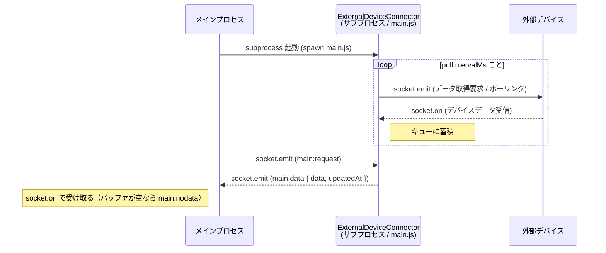

# 概要
このプロジェクトは外部デバイスと socket 通信し、外部デバイスを一定間隔でポーリングして受信データをキューに蓄積し、メインプロセスからの要求には最新 1 件を返す。

前提として、このプロジェクトは他プロセスからサブプロセスとして独立したプロセスで実行される。

# 動作、インタフェース
このプロジェクトの動作とインタフェースは以下とする

- メインプロセスから本プロジェクトの main.js をサブプロセスとして実行する
- 本プロジェクトでは外部デバイスとの接続を socket 通信で確立
  - 接続中は一定間隔（`pollIntervalMs`）で socket.emit して外部デバイスにデータ取得を要求（ポーリング）
  - socket.on で外部デバイスからのデータを受け取り、キューにデータを蓄積
  - 切断時はポーリングを停止し、再接続時に再開する
- メインプロセスとの接続を socket 通信で確立
  - メインプロセスからの socket.emit（`main:request`）を受け取る
  - キューの最新値を socket.emit（`main:data`）で即時返却する（外部デバイスへの再要求は行わない）
  - キューが空（未受信）の場合は `main:nodata` を返す
  - メインプロセスでは socket.on で外部デバイスデータを受け取る

## 外部デバイス向け socket.io イベント仕様
外部デバイス側が実装すべきイベント。Connector はポーリングごとに `device:request` を送り、`device:data` を受信する。

| イベント名 | 方向 | 説明 |
|---|---|---|
| `device:request` | Connector → 外部デバイス | ポーリングでデータ取得を要求する |
| `device:data` | 外部デバイス → Connector | デバイスデータを返す。受信データはそのままキューに蓄積される |

## メインプロセス向け socket.io イベント仕様
| イベント名 | 方向 | 説明 |
|---|---|---|
| `main:request` | メインプロセス → Connector | データ取得を要求する |
| `main:data` | Connector → メインプロセス | キュー内の最新デバイスデータを `{ data, updatedAt }` で返す。`updatedAt` は Connector がデータを受信した時刻（ISO8601 文字列）であり、デバイス側のタイムスタンプではない |
| `main:nodata` | Connector → メインプロセス | キューが空（デバイス未受信）のときに返す |

# 基盤
- node.js

# 実行手順
main.js は第1引数に JSON 文字列で設定を渡す。引数省略や不足はエラーとなり、終了コード 1 で終了する。

## エントリポイント
`main.js`

## 設定を指定して起動
```
# PowerShell からの起動例
node main.js '{"deviceUrl":"http://192.168.1.10:9001","mainPort":9002,"pollIntervalMs":3000}'
```

## メインプロセスからサブプロセスとして起動する例
```
const { spawn } = require('child_process');

const config = { deviceUrl: 'http://localhost:9001', mainPort: 9002, pollIntervalMs: 3000 };
const child = spawn('node', ['main.js', JSON.stringify(config)], { stdio: 'inherit' });
```

## デバッグ: 外部デバイスにダミーを使用してデバイスとの接続状態を作成
```
cd javascript/DeviceConnect/ExternalDeviceConnector
npm install
node example/externalDevice.js   # 別ターミナルで外部デバイス(ダミー)を起動
node main.js (Get-Content .\example\local-config.json -Raw)
```

## デバッグ: メインプロセスおよびダミー外部デバイスとの一連のデータ送受
一連の流れを `example/localDemo.js` に実装。package.json の `example` にこのファイルを実行するよう設定。

## 設定パラメータ一覧
| キー | 型 | 必須 | 説明 |
|---|---|---|---|
| `deviceUrl` | string | 必須 | 外部デバイスの socket.io URL |
| `mainPort` | number | 必須 | メインプロセスと通信するポート番号（正の整数） |
| `pollIntervalMs` | number | 必須 | 外部デバイスへのポーリング間隔（ms、正の整数） |
| `saveFile` | ※1 | 任意 | 外部デバイスデータをファイルに保存する場合の必須パラメーター |

※1: `saveFile` は以下要素を持つオブジェクト

| キー | 型 | 必須 | 説明 |
|---|---|---|---|
| `dataFilePath` | string | 必須 | 外部デバイスデータ保存先ファイルパス |
| `rotationKb` | number | 必須 | ファイルローテーション基準サイズ(KB) |
| `maxSaveFileNum` | number | 必須 | 保存するファイル最大数 |

ファイルに保存する場合の最大サイズ = `rotationKb * maxSaveFileNum (KB)`

`saveFile` 例: 
```json
"saveFile": {
  "dataFilePath": ".\\data_file.txt",
  "rotationKb": 1000,
  "maxSaveFileNum": 5
}
```

# データ保存ファイル機能
`config` の `saveFile` が定義されている場合に本機能が有効

## 概要
- 外部デバイスデータをファイルに保存する
- ファイル保存タイミングは 500ms 毎。キューの未保存分をまとめて保存する
- ファイル保存に成功したデータをキューから削除する
  - ファイル保存失敗した場合は次回の 500ms 毎処理でリトライする
- `dataFilePath` の親ディレクトリが存在しない場合は自動作成する

## 保存フォーマット
- 1 行 1 レコードの JSON（JSONL）で追記する
- 各行は `{ "data": <デバイスデータ>, "updatedAt": <ISO8601 文字列> }`

保存例:
```
{"data":{"seq":0,"value":42,"at":1756500000000},"updatedAt":"2026-08-29T06:00:00.000Z"}
{"data":{"seq":1,"value":37,"at":1756500003000},"updatedAt":"2026-08-29T06:00:03.000Z"}
```

## キュー上限
- ポーリング 100ms での 8h 相当である 288,000 件
- 超過する場合は最古のデータを削除する(FIFO)

## ローテーション
- ローテーション処理を実行した日時を `yyyyMMdd_HHmmss` 形式でファイル名に追加する。
- 1 秒立たずにローテーションする場合はファイル名重複しないよう連番対処
  - data_20260829_153000_1.log, data_20260829_153000_2.log ...
  - 連番は 1 から始める

例: `dataFilePath = "./log.txt"`, `maxSaveFileNum = 5` の場合

```
log.txt -> 最新データ
log_20260829_130000.txt -> 次ローテーションする場合、このファイルが消える
log_20260829_133000.txt
log_20260829_133000_1.txt
log_20260829_143000.txt -> ローテーションファイルの中では最新ファイル
```

例: `dataFilePath = "./log.txt"`, `maxSaveFileNum = 1` の場合

```
log.txt -> 最新データ。このファイルのサイズがしきい値をおおむね超えた場合※、このファイルを削除して新規に log.txt を作成する
```

※書き込み後にチェックするためしきい値を超過してからローテーションする

# 異常時
## 起動時の設定不正
- argv 欠落 / JSON パース失敗 / 必須パラメータの型・値不正
- この場合のメインプロセスとの契約は T.B.D.

## データ保存ファイル保存先ディレクトリ作成失敗
- この場合のメインプロセスとの契約は T.B.D.

## メインプロセスとの通信用サーバー起動時のポート競合
- `mainPort` が使用中の場合
- この場合のメインプロセスとの契約は T.B.D.

## メインプロセスとの通信回復不可
- 一時的な通信不可は `socket.io` により自動的に復旧を試みる
- 復旧不可の場合、メインプロセスからはデータ要求に対してタイムアウトする
- この場合はメインプロセスから本プロセスを終了し、再度本プロセスを立ち上げ直すことを推奨する

## 外部デバイスとの通信に一度も成功しない
- 外部デバイスデータ保存キャッシュが空になるため `main:nodata` が返り続ける
- この場合は本プロセスと外部デバイスとの通信に継続的な異常があるため、その経路を調査すること

## 外部デバイスからのデータが不正
- 外部デバイスからのデータは一度シリアライズ(JSON 化)されてから届くため、JSON オブジェクト内での循環参照などはないと判断してその辺は未検証とする
- 受け取った JSON 文字列を JSON インスタンス化に失敗する場合はあり得る
  - undefined や BigInt などの `JSON.stringfy` 想定外の場合
- 受信データの検証は T.B.D.
  - メインプロセスとの契約も要検討

## 外部デバイスからのデータが巨大
- 1 レコードが極端に大きい場合
- 受信データの検証は T.B.D.
  - メインプロセスとの契約も要検討

## 外部デバイスとの通信回復不可
- 一時的な通信不可は `socket.io` により自動的に復旧を試みる
- 復旧不可の場合、メインプロセスからは `{ data, updatedAt }` で返ってきた `updatedAt` が以前取得した時点から変化なし
- この場合は本プロセスと外部デバイスとの通信に継続的な異常があるため、その経路を調査すること

## データ保存ファイルへの書き込み: 最初から失敗する条件を満たしている
- 書き込み権限不足などの場合
- この場合のメインプロセスとの契約は T.B.D.

## データ保存ファイルへの書き込み: ハング
- 内部的には書き込み中フラグの true / false によりポーリング時に書き込み処理を実行するかを決定する
- 書き込み処理がハングするとフラグが false に戻らないため以降書き込み処理を実行しなくなる
- この場合の対策やメインプロセスとの契約は T.B.D.

## データ保存ファイルへの書き込み: 一時的な失敗
- 一時的な失敗はポーリングによるリトライで吸収するためメインプロセス側からの対応不要

## データ保存ファイルへの書き込み: 途中から失敗し続ける
- 失敗し続ける場合はキュー上限超過によるキュー溢れの可能性が出る
  - 内部的には 100ms ポーリングの 8h 換算で 288,000 件保持のため運用上の問題はないはず
- 途中から容量不足になった場合もこうなる
- この場合の対策やメインプロセスとの契約は T.B.D.

## データ保存ファイルのローテーション失敗
- TODO

## プロセスの予期せぬ異常
- 現状例外検知なし、プロセスが落ちることになる
- この場合の対策やメインプロセスとの契約は T.B.D.


# 概要図
ポートは外部デバイス=9001、Connector=9002 の想定（起動時 JSON 引数の `deviceUrl` / `mainPort` で変更可、ポーリング間隔は `pollIntervalMs`）


