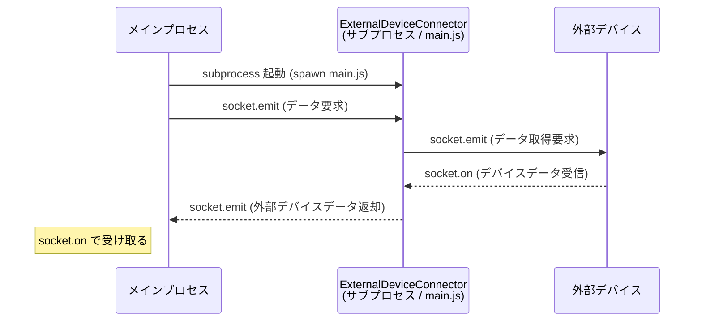

# 概要
このプロジェクトは外部デバイスと socket 通信し、メインプロセスからの要求を契機に外部デバイスからデータを取得して返却する。

前提として、このプロジェクトは他プロセスからサブプロセスとして独立したプロセスで実行される。

# 動作、インタフェース
このプロジェクトの動作とインタフェースは以下とする

- メインプロセスから本プロジェクトの main.js をサブプロセスとして実行する
- 本プロジェクトでは外部デバイスとの接続を socket 通信で確立
  - socket.emit で外部デバイスにデータ取得を要求
  - socket.on で外部デバイスからのデータを受け取る
- メインプロセスとの接続を socket 通信で確立
  - メインプロセスからの socket.emit を受け取る
  - 外部デバイスデータを socket.emit で返す
  - メインプロセスでは socket.on で外部デバイスデータを受け取る

## メインプロセス向け socket.io イベント仕様
| イベント名 | 方向 | 説明 |
|---|---|---|
| `main:request` | メインプロセス → Connector | データ取得を要求する |
| `main:data` | Connector → メインプロセス | 外部デバイスから取得したデータを返す |

# 基盤
- node.js

# 実行手順
main.js は第1引数に JSON 文字列で設定を渡す。引数省略や不足はエラーになる。

## 設定を指定して起動
```
# PowerShell からの起動例
node main.js '{"deviceUrl":"http://192.168.1.10:9001","mainPort":9002}'
```

## メインプロセスからサブプロセスとして起動する例
```
const { spawn } = require('child_process');

const config = { deviceUrl: 'http://localhost:9001', mainPort: 9002 };
const child = spawn('node', ['main.js', JSON.stringify(config)], { stdio: 'inherit' });
```

## デバッグ: 外部デバイスにダミーを使用してデバイスとの接続状態を作成
```
cd javascript/DeviceConnect/ExternalDeviceConnector
npm install
node example/externalDevice.js   # 別ターミナルで外部デバイス(ダミー)を起動
node main.js (Get-Content .\example\local-config.json -Raw)
```

## デバッグ: ダミー外部デバイスから都度データ取得する流れを実行
一連の流れを `example/localDemo.js` に実装。package.json の `example` にこのファイルを実行するよう設定。

## 設定パラメータ一覧
| キー | 型 | 必須 | 説明 |
|---|---|---|---|
| `deviceUrl` | string | 必須 | 外部デバイスの socket.io URL |
| `mainPort` | number | 必須 | メインプロセスと通信するポート番号 |

# 概要図
ポートは外部デバイス=9001、Connector=9002 の想定（起動時 JSON 引数の `deviceUrl` / `mainPort` で変更可）


