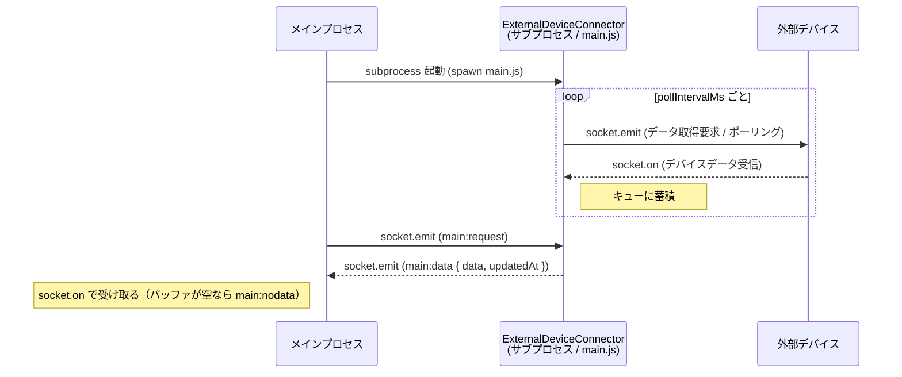
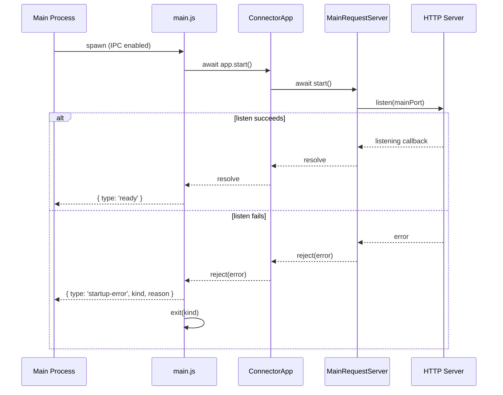

# 概要
このプロジェクトは外部デバイスと socket 通信し、外部デバイスを一定間隔でポーリングして受信データをキューに蓄積し、メインプロセスからの要求には最新 1 件を返す。

前提として、このプロジェクトは他プロセスからサブプロセスとして独立したプロセスで実行される。

# 動作、インタフェース
このプロジェクトの動作とインタフェースは以下とする

- メインプロセスから本プロジェクトの main.js をサブプロセスとして実行する
- 本プロジェクトでは外部デバイスとの接続を socket 通信で確立
  - 接続中は一定間隔（`pollIntervalMs`）で socket.emit して外部デバイスにデータ取得を要求（ポーリング）
  - socket.on で外部デバイスからのデータを受け取り、キューにデータを蓄積
  - 切断時はポーリングを停止し、再接続時に再開する
- メインプロセスとの接続を socket 通信で確立
  - メインプロセスからの socket.emit（`main:request`）を受け取る
  - キューの最新値を socket.emit（`main:data`）で即時返却する（外部デバイスへの再要求は行わない）
  - キューが空（未受信）の場合は `main:nodata` を返す
  - メインプロセスでは socket.on で外部デバイスデータを受け取る

## 外部デバイス向け socket.io イベント仕様
外部デバイス側が実装すべきイベント。Connector はポーリングごとに `device:request` を送り、`device:data` を受信する。

| イベント名 | 方向 | 説明 |
|---|---|---|
| `device:request` | Connector → 外部デバイス | ポーリングでデータ取得を要求する |
| `device:data` | 外部デバイス → Connector | デバイスデータを返す。サイズ制限を超えたデータは破棄される |

## メインプロセス向け socket.io イベント仕様
| イベント名 | 方向 | 説明 |
|---|---|---|
| `main:request` | メインプロセス → Connector | データ取得を要求する |
| `main:data` | Connector → メインプロセス | キュー内の最新デバイスデータを `{ data, updatedAt }` で返す。`updatedAt` は Connector がデータを受信した時刻（ISO8601 文字列）であり、デバイス側のタイムスタンプではない |
| `main:nodata` | Connector → メインプロセス | キューが空（デバイス未受信）のときに返す |
| `main:data-oversized` | Connector → メインプロセス | 直近の受信データがサイズ超過または JSON 文字列化失敗のときに `{ data, updatedAt }` を返す。正常データがなければ値は `{ data: null, updatedAt: null }` |

# 基盤
- node.js

# 実行手順
main.js は第1引数に JSON 文字列で設定を渡す。引数省略や不足はエラーとなり、終了コード 1 で終了する。

## エントリポイント
`main.js`

## 設定を指定して起動
```
# PowerShell からの起動例
node main.js '{"deviceUrl":"http://192.168.1.10:9001","mainPort":9002,"pollIntervalMs":3000}'
```

## メインプロセスからサブプロセスとして起動する例
```
const { spawn } = require('child_process');

const config = { deviceUrl: 'http://localhost:9001', mainPort: 9002, pollIntervalMs: 3000 };
const child = spawn('node', ['main.js', JSON.stringify(config)], { stdio: ['ignore', 'inherit', 'inherit', 'ipc'] });
```
`ready` / `startup-error` を IPC で受け取るには `stdio` に `'ipc'` を含める必要がある。

## デバッグ: 外部デバイスにダミーを使用してデバイスとの接続状態を作成
```
cd javascript/DeviceConnect/ExternalDeviceConnector
npm install
node example/externalDevice.js   # 別ターミナルで外部デバイス(ダミー)を起動
node main.js (Get-Content .\example\local-config.json -Raw)
```

## デバッグ: メインプロセスおよびダミー外部デバイスとの一連のデータ送受
一連の流れを `example/localDemo.js` に実装。package.json の `example` にこのファイルを実行するよう設定。

## 設定パラメータ一覧
| キー | 型 | 必須 | 説明 |
|---|---|---|---|
| `deviceUrl` | string | 必須 | 外部デバイスの socket.io URL |
| `mainPort` | number | 必須 | メインプロセスと通信するポート番号（正の整数） |
| `pollIntervalMs` | number | 必須 | 外部デバイスへのポーリング間隔（ms、正の整数） |
| `maxDeviceDataBytes` | number | 任意 | 1 レコードの許容サイズ。`JSON.stringify` 後の文字列長（ASCII 前提、JSON 構文文字を含む）で判定する正の整数。未設定時は検証しない。迷った場合は JSON 構文文字を含む 5KiB 相当の `5120` を推奨 |
| `saveFile` | ※1 | 任意 | 外部デバイスデータをファイルに保存する場合の必須パラメーター |

※1: `saveFile` は以下要素を持つオブジェクト

| キー | 型 | 必須 | 説明 |
|---|---|---|---|
| `dataFilePath` | string | 必須 | 外部デバイスデータ保存先ファイルパス |
| `rotationKb` | number | 必須 | ファイルローテーション基準サイズ(KB) |
| `maxSaveFileNum` | number | 必須 | 保存するファイル最大数 |

ファイルに保存する場合の最大サイズ = `rotationKb * maxSaveFileNum (KB)`

`saveFile` 例: 
```json
"saveFile": {
  "dataFilePath": ".\\data_file.txt",
  "rotationKb": 1000,
  "maxSaveFileNum": 5
}
```

# データ保存ファイル機能
`config` の `saveFile` が定義されている場合に本機能が有効

## 概要
- 外部デバイスデータをファイルに保存する
- ファイル保存タイミングは 500ms 毎。キューの未保存分をまとめて保存する
- ファイル保存に成功したデータをキューから削除する
  - ファイル保存失敗した場合は次回の 500ms 毎処理でリトライする
- `dataFilePath` の親ディレクトリが存在しない場合は自動作成する

## 保存フォーマット
- 1 行 1 レコードの JSON（JSONL）で追記する
- 各行は `{ "data": <デバイスデータ>, "updatedAt": <ISO8601 文字列> }`

保存例:
```
{"data":{"seq":0,"value":42,"at":1756500000000},"updatedAt":"2026-08-29T06:00:00.000Z"}
{"data":{"seq":1,"value":37,"at":1756500003000},"updatedAt":"2026-08-29T06:00:03.000Z"}
```

## キュー上限
- ポーリング 100ms での 8h 相当である 288,000 件
- 超過する場合は最古のデータを削除する(FIFO)

## ローテーション
- ローテーション処理を実行した日時を `yyyyMMdd_HHmmss` 形式でファイル名に追加する。
- 1 秒立たずにローテーションする場合はファイル名重複しないよう連番対処
  - data_20260829_153000_1.log, data_20260829_153000_2.log ...
  - 連番は 1 から始める

例: `dataFilePath = "./log.txt"`, `maxSaveFileNum = 5` の場合

```
log.txt -> 最新データ
log_20260829_130000.txt -> 次ローテーションする場合、このファイルが消える
log_20260829_133000.txt
log_20260829_133000_1.txt
log_20260829_143000.txt -> ローテーションファイルの中では最新ファイル
```

例: `dataFilePath = "./log.txt"`, `maxSaveFileNum = 1` の場合

```
log.txt -> 最新データ。このファイルのサイズがしきい値をおおむね超えた場合※、このファイルを削除して新規に log.txt を作成する
```

※書き込み後にチェックするためしきい値を超過してからローテーションする

# 異常時
## メインプロセスからの本プロセス異常の受け取り方
### 起動成否
- 要約: IPC を使用する
- 起動成功した場合
  - 本プロセスは以下を返す
    - `process.send({ type: 'ready' });`
    - `ready` はメインプロセス向け HTTP/socket.io サーバー（`mainPort`）の listener が利用可能になった通知であり、外部デバイスとの接続確立・初回データ受信の完了通知ではない
      - `main:request` はこの時点から送ってよい。外部デバイス未接続・未受信の場合は `main:nodata` が返る
- 起動失敗した場合
  - 本プロセスは以下を実行する
    - `startup-error` メッセージを送る
      - `process.send({ type: 'startup-error', kind: error?.kind, reason: String(error?.message ?? error) });`
    - `process.exit(非0)` を実行し、確実に本プロセスを終了する
      - 終了コードは `startup-error` メッセージ送信時の `kind` と同一とする
      - 具体的な終了コードは下記参照(全て T.B.D.)
- メインプロセスでの受け取り方例: 
  - ```
    const child = spawn('node', ['main.js', json], { stdio: ['ignore', 'inherit', 'inherit', 'ipc'] });
    const timer = setTimeout(() => child.kill(), 5000); // ready が来ない
    child.on('message', (msg) => {
      if (msg.type === 'ready') { clearTimeout(timer); /* 起動成功 */ }
      if (msg.type === 'startup-error') { clearTimeout(timer); /* msg.reason で分類 */ }
    });
    child.on('exit', (code) => { clearTimeout(timer); /* ready/startup-error が届かず終了した場合 */ });
    ```
  - 親プロセスは `ready`・`startup-error`・子プロセスの `exit`・タイムアウトのすべてを監視すること

### 実行中の異常
- T.B.D.

### プロセス終了時の異常
- T.B.D.

## 本プロセスで想定する異常系
### 起動時の設定不正
- argv 欠落 / JSON パース失敗 / 必須パラメータの型・値不正
- この場合のメインプロセスとの契約
  - `メインプロセスからの本プロセス異常の受け取り方` の `起動成否` の通りのメッセージと挙動とする
  - 終了コード: `1`

### データ保存ファイル保存先ディレクトリ作成失敗
- この場合のメインプロセスとの契約
  - `メインプロセスからの本プロセス異常の受け取り方` の `起動成否` の通りのメッセージと挙動とする
  - 終了コード: `2`

### メインプロセスとの通信用サーバー起動時のポート競合
- `mainPort` が使用中の場合
- この場合のメインプロセスとの契約
  - `メインプロセスからの本プロセス異常の受け取り方` の `起動成否` の通りのメッセージと挙動とする
  - 終了コード: `3`

### メインプロセスとの通信回復不可
- 一時的な通信不可は `socket.io` により自動的に復旧を試みる
- 復旧不可の場合、メインプロセスからはデータ要求に対してタイムアウトする
- この場合はメインプロセスから本プロセスを終了し、再度本プロセスを立ち上げ直すことを推奨する

### 外部デバイスとの通信に一度も成功しない
- 外部デバイスと通信はできてもデバイス側が沈黙する場合もここに含む
- 外部デバイスデータ保存キャッシュが空になるため `main:nodata` が返り続ける
- この場合は本プロセスと外部デバイスとの通信に継続的な異常があるため、その経路を調査すること

### 外部デバイスからのデータが不正
- 外部デバイスからのデータは内部的な socket.io-client の挙動により JSON オブジェクトとして受け取る
- つまり JSON として不正なデータを受け取る余地がないため、本事象は考えないものとする

### 外部デバイスからのデータが巨大
- 1 レコードが極端に大きい場合
- `maxDeviceDataBytes` が設定されている場合、`JSON.stringify(data).length` がしきい値を超えたデータを受信直後に破棄する
  - キャッシュ更新、ファイル保存キュー登録、ファイル書き込みは行わない
  - データ本体はログ出力せず、しきい値と超過または stringify エラーの種別だけを警告する
- メインプロセスから `main:request` を受けた場合は `main:data-oversized` を返す
  - 以前に正常データを受信していれば、そのデータと時刻を返す
  - 正常データ未受信なら `{ data: null, updatedAt: null }` を返す
- TODO: 巨大データを `JSON.stringify(data)` する処理に時間がかかるため、この検証処理が全体的な遅延を引き起こす可能性あり。より軽量な検証ロジックに変更したい

### 外部デバイスとの通信回復不可
- 一時的な通信不可は `socket.io` により自動的に復旧を試みる
- 復旧不可の場合、メインプロセスからは `{ data, updatedAt }` で返ってきた `updatedAt` が以前取得した時点から変化なし
- この場合は本プロセスと外部デバイスとの通信に継続的な異常があるため、その経路を調査すること

### データ保存ファイルへの書き込み: 最初から失敗する条件を満たしている
- 書き込み権限不足などの場合
- この場合のメインプロセスとの契約は T.B.D.

### データ保存ファイルへの書き込み: ハング
- 内部的には書き込み中フラグの true / false によりポーリング時に書き込み処理を実行するかを決定する
- 書き込み処理がハングするとフラグが false に戻らないため以降書き込み処理を実行しなくなる
- この場合の対策やメインプロセスとの契約は T.B.D.

### データ保存ファイルへの書き込み: JSON オブジェクトの文字列化失敗
- JSON.stringify が例外を投げる条件
  - 値の不正によるもの
    - 循環参照 → TypeError: Converting circular structure to JSON
    - BigInt を含む → TypeError: Do not know how to serialize a BigInt
    - これらは socket.io-client により有効な JSON オブジェクトを受け取っているため起こりえないとする
  - 値の巨大さによるもの
    - 極端に深いネスト → RangeError: Maximum call stack size exceeded
    - 結果文字列が V8 の上限を超える → RangeError: Invalid string length
    - こちらは発生する可能性あり
- 以下のため、本事象は `外部デバイスからのデータが巨大` に吸収する

### データ保存ファイルへの書き込み: 一時的な失敗
- 一時的な失敗はポーリングによるリトライで吸収するためメインプロセス側からの対応不要

### データ保存ファイルへの書き込み: 途中から失敗し続ける
- 失敗し続ける場合はキュー上限超過によるキュー溢れの可能性が出る
  - 内部的には 100ms ポーリングの 8h 換算で 288,000 件保持のため運用上の問題はないはず
- 途中から容量不足になった場合もこうなる
- この場合の対策やメインプロセスとの契約は T.B.D.

### データ保存ファイルのローテーション失敗
- TODO

### プロセスの予期せぬ異常
- 現状例外検知なし、プロセスが落ちることになる
- この場合の対策やメインプロセスとの契約は T.B.D.

### メインプロセス消失による本プロセスの残留
- この場合は本プロセスが残ってポーリングを続けることになるため以下問題がある
  - 外部デバイスとの通信ポーリングが残る
    - データ保存ファイルの容量が増え続けるなど
  - 何も知らずにメインプロセス再起動すると本プロセスを 2 重に走らせる可能性あり
    - ポート設定を変えなければポート競合による本プロセス起動失敗となる
- この場合の対策やメインプロセスとの契約は T.B.D.

# 図
## 概要図
ポートは外部デバイス=9001、Connector=9002 の想定（起動時 JSON 引数の `deviceUrl` / `mainPort` で変更可、ポーリング間隔は `pollIntervalMs`）



## 本プロセス起動時
メインプロセスから本プロセスを起動し、メインプロセスとの疎通が成功/失敗してメッセージを返すまでの概要図

