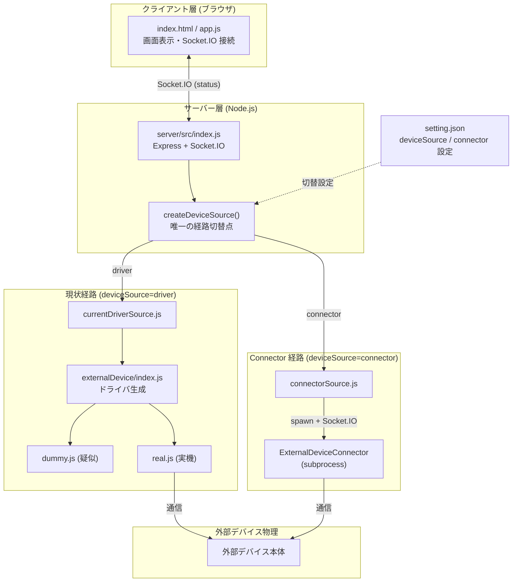
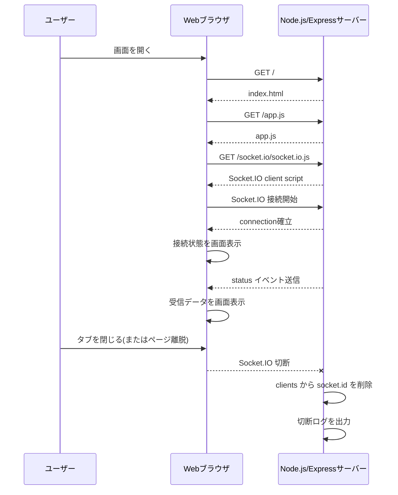
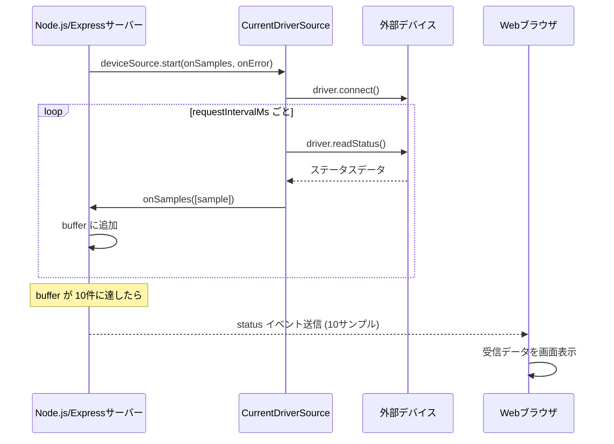
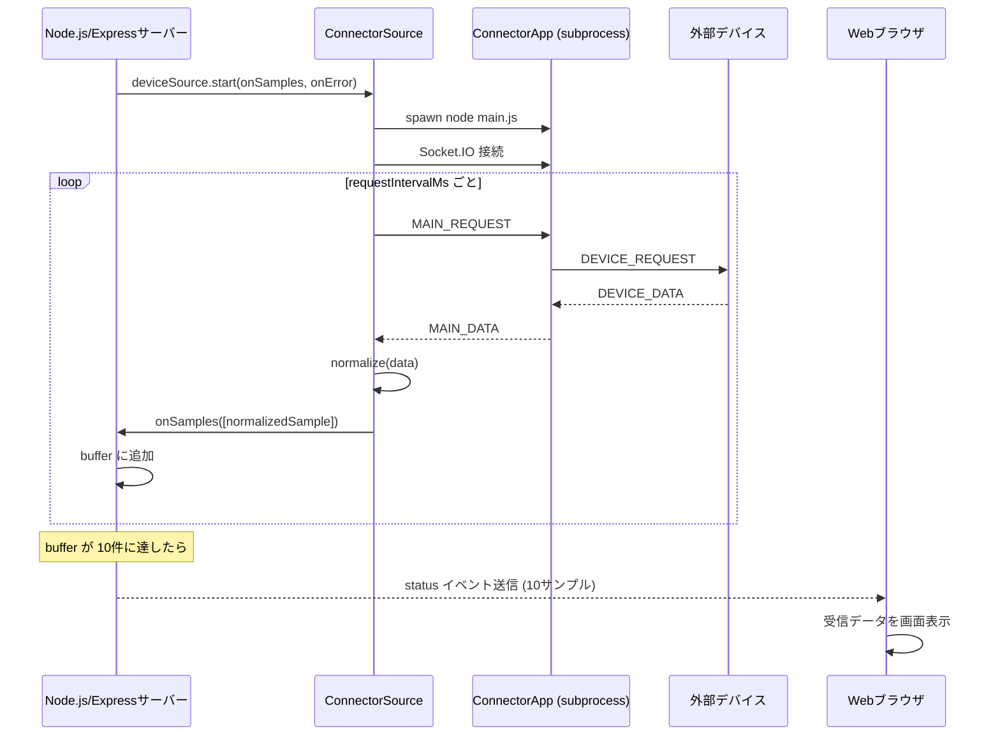

# 環境構築手順
## Node.js LTS インストール
```
winget install --id OpenJS.NodeJS.LTS -e --accept-package-agreements --accept-source-agreements --scope user
```
インストール後は VSCode 再起動して PATH 更新を適用する

## プロジェクト依存パッケージインストール
```
cd <package.json 配置フォルダ>
npm install
```
結果は `node_modules` フォルダにインストールされる

# デバッグ実行
package.json からデバッグ実行する

# 全体構成


## setting.json 設定項目

| キー | 値 | 説明 |
|------|----|------|
| `deviceSource` | `"driver"` / `"connector"` | 取得経路スイッチ。`connector` の場合は ExternalDeviceConnector を使用する |
| `userWebClientListenPort` | 例: `8082` | ユーザー Web ブラウザからの接続を待ち受けるポート番号 |
| `externalDeviceMode` | `"dummy"` / `"real"` | `driver` 経路のみ有効。疑似デバイス or 実機 |
| `externalDeviceUrl` | 例: `"http://192.168.0.10:9600"` | `real` モード時の外部デバイス接続先 URL |
| `requestIntervalMs` | ミリ秒 | 外部デバイスデータを取得するポーリング間隔 |
| `connector.deviceUrl` | URL | `connector` 経路のみ有効。ExternalDeviceConnector が接続する外部デバイス URL |
| `connector.externalDeviceConnectorServerPort` | 例: `9002` | ExternalDeviceConnector がサーバーとして Listen するポート |

# メッセージ遷移
## ユーザー Web ブラウザ接続時と接続解除時


## 外部デバイスのデータ取得してユーザー Web ブラウザに表示

### driver 経路（deviceSource=driver）



### connector 経路（deviceSource=connector）


